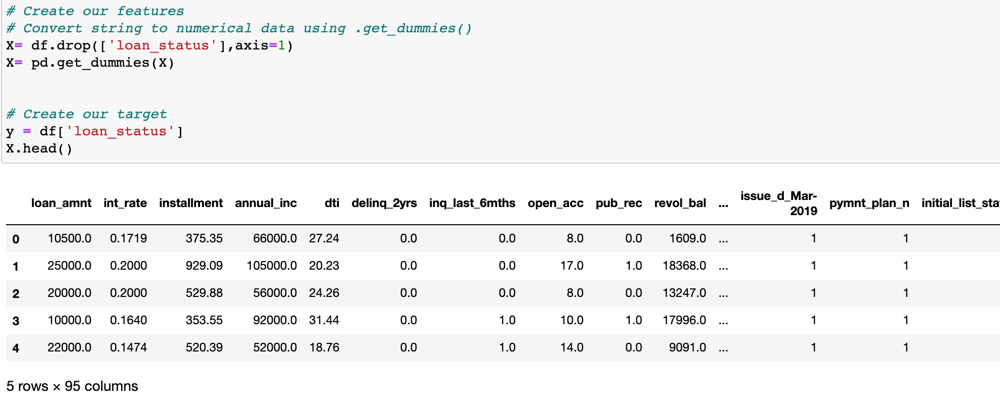
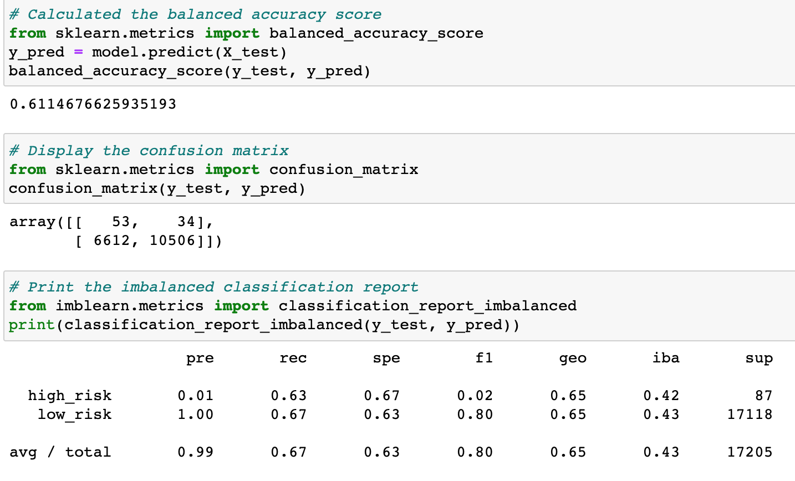
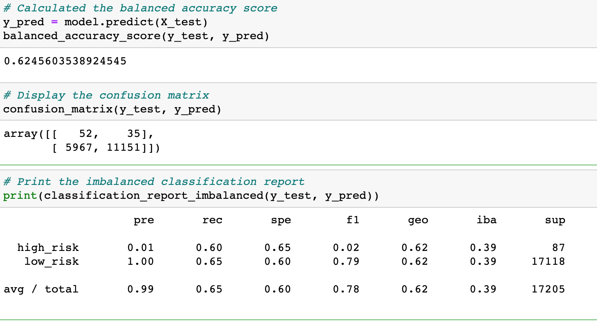
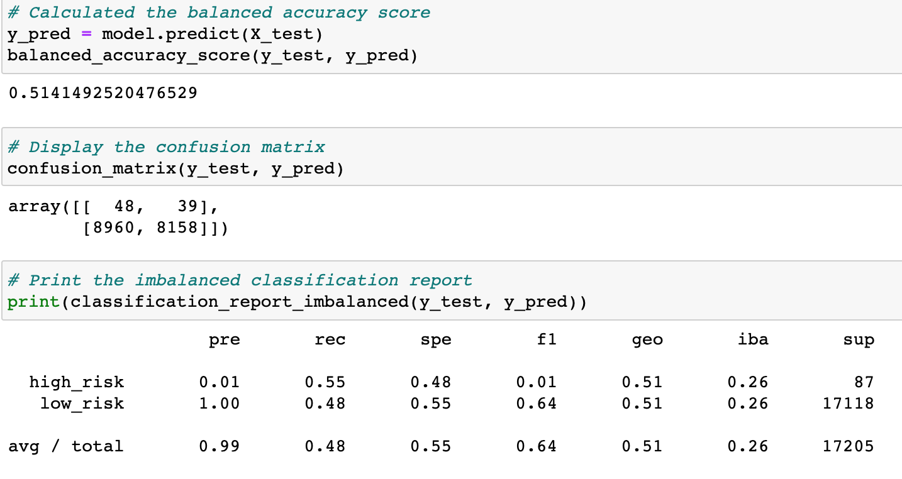
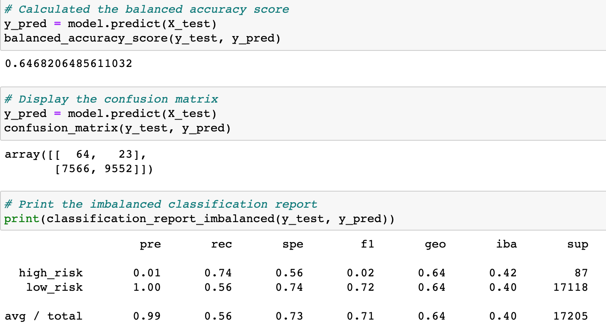
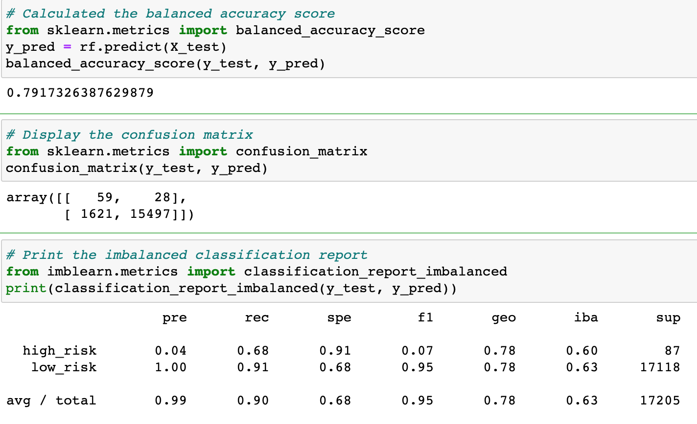
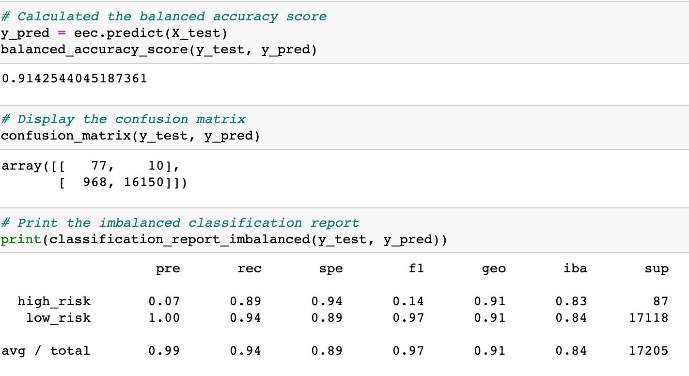
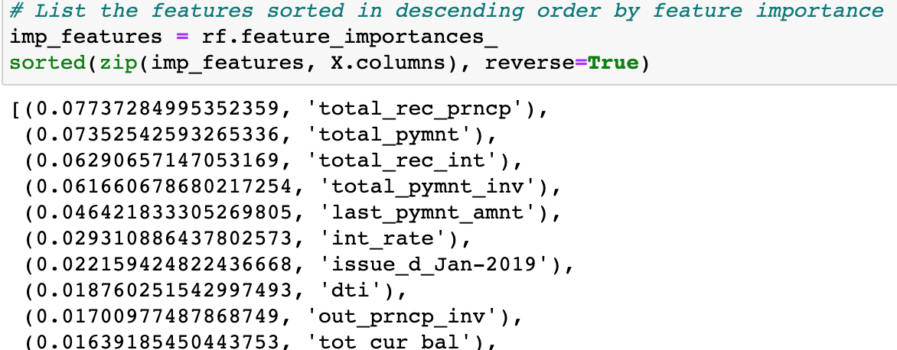

# credit_risk_analysis
## Project Overview
Given a credit card data set from a Peer-to-Peer lending service company, we will use a number of sampling algorithims to create models that will predict credit risk and assist us in our decision making process. We will test various over sampling, under sampling, and combination algorithims to ascertain the most effective algorithim to use. We will also compare two machine learning models to determine which performs the best and decide if it should be a tool used in the future when determining credit risk.

## Resources
Data Source: "LoanStats_2019Q1.csv"
Software Used: Python 3.8.8, Jupyter Notebook, Virtual Studio Code 1.57.0

## Preprocessing the Data
First we had to clean the data, and identify our target variable. We also used the .get_dummies() method to convert any string variables into integer data, and scale the numeric data.
Code can be seen below.

## Results
To avoid the issue of class imbalance, we tried a variety of techniques to address the problem. Centroid Clusted undersampling, random oversampling, SMOTE oversampling, and a combination over/under sampling were all used to resample the data. We also used the Random Forest and Easy Ensemble classifier models to predict credit risk. Those results are below.
* Random Oversample 
    
* SMOTE Oversample
    
* Cenrtoid Clusted Undersample
    
* SMOTEEN Combination 
    
* Balanced Random Forest Classifier
    
* Easy Ensemble Classifier
    

After running the Balanced Random Forest algorithim with our data, we sorted and ranked each feature by importance to the model. Those top 10 most important features for this model can be seen here.
    

## Summary
After reviewing the 6 models used, in this instance the Easy Ensemble Classifier was most effective in dealing with the inherent class imbalance of our data and coming out with a useful, predictive model. The balanced accuracy score of the Easy Ensemble model was 0.91 compared where the other 5 were all below 0.79. In addition the precision of the Easy Ensemble model was higher than all others tested. 